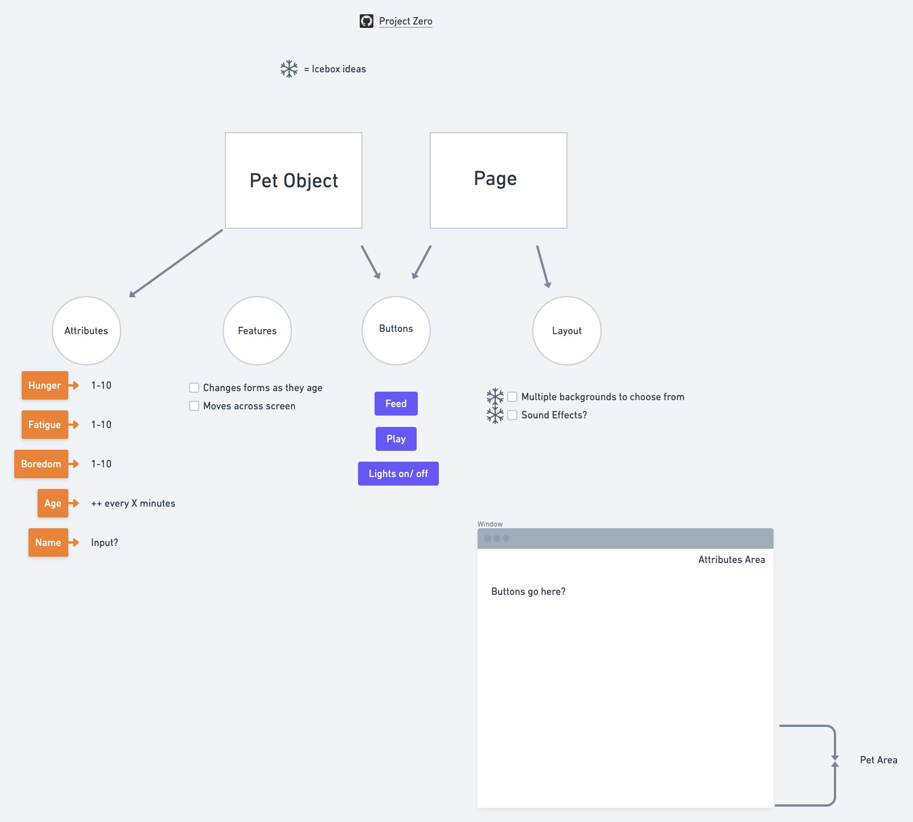
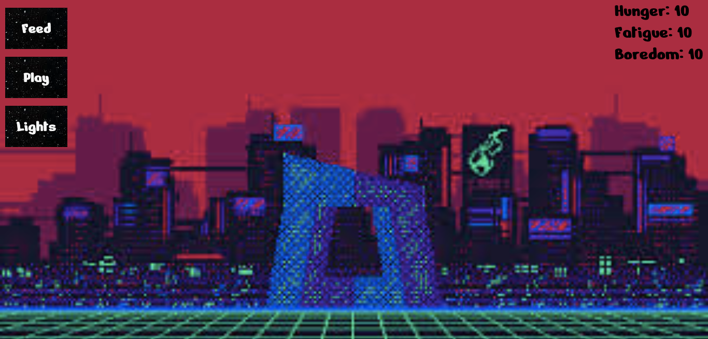
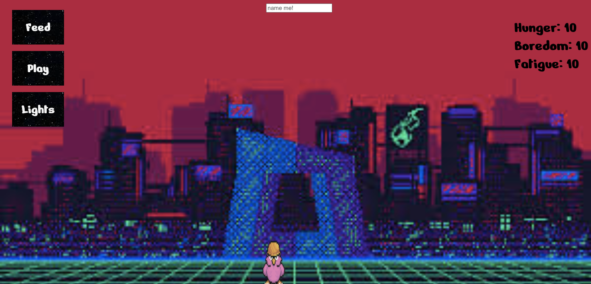
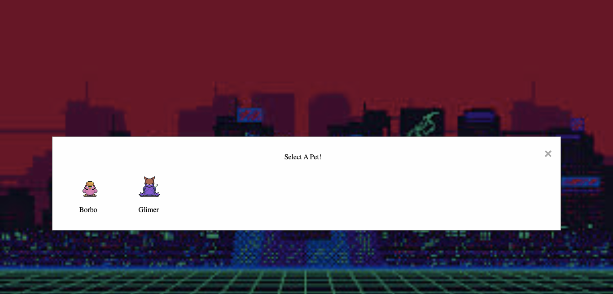

<!-- Gabe's Tamagotchi Game -->

<!-- Basic Summary of the game: -->

# User Story:

This is intended to be a basic tamagotchi remake, no weird quirks or anything. Just a faithful interpretation of the originial mechanics of the game. 
Time permitting, however, I will add additional features, which will be noted at the end of this section.

The intent of the user experience with this game is a simple pet caretaking game, with a few sprites to choose from that I found for free on the internet.

There are a few basic attributes the player will need to manage by feeding, playing with, and otherwise taking care of their tamagotchi.

As you play, the age of your tamagotchi will increase, eventually causing their form to change from child to adult to elder.

The original design of this game is for short-lived pets, as there are no save features at this time. Live fast, die young, and leave a cute corpse.

# DAY 1 (Monday):

Going for an object-oriented approach. 

Right off the bat, it seemed to make the most sense to store all the properties in one HUGE pet object.

Created basic file structure.

The goal is to create the tamagotchi object as well as the basic, required properties.

Additional goal for the day/goal going into tomorrow: find an image and append it to the DOM using jquery to represent the tama.

ran into some issues with background sizing, but CSS tricks had my back.

# Day 2 (Tuesday):

Got a working demo of the wireframe going. 

Did a lot of research in breakout rooms, but mostly for icebox stuff.

first thing I got done once lab time started was getting the attributes appended to the page:
    I created a section with an id of 'attribute-area', gave it absolute positioning, and gave it a 0 value for 'top' and 'right' in css.
    after adding a fun font, it actually pushed the text down a bit. one solution could have been to move the ul inside the section, but instead i just gave the entire section a negative top margin.

added buttons to the page as well. surprising amount of css done today for me. most things are on the page now.

ran into some weirdness about opening my index.html in my default browser and some jquery stuff, but got it sorted by instructors.

ended the day working on the actual logic for the 'feed' button. it's console.log-ing stuff on click, but not changing values in the object or on the page. probably am doing something wrong in jquery.

## here's how we're looking at the end of day 2, site-wise:

# Day 3 (Wednesday):

Came into the day with some issues from working on the project after hours.

Namely, my feed button wasn't working the way I wanted to. I was able to use jquery to grab the button and assign an onclick, but I could only get it to console.log, and not actually interact with the pet object. Once I got into my breakout room, I was able to work with others to figure out that the issue was that due to a scoping issue, the 'this' in the object method was being made to refer to the button. It turned out I had already ran into one of those edge cases mentioned in class where you need to use an arrow function in order to fix scope issues. Once I did that, the scope went back to global, and 'this' was able to refer to the tama object. 

Css trick adonis showed me in breakout room:

creating a 'styles' object to make it easier to apply multiple css stylings when applying the .css() jquery method.
made applying multiple effects to the '#lights-off' div very easy. bound them all to styles inside the 'toggleLights' function, then just have the lights button run the function '$("#lights-off").css(styles)'.

having a LOT of css issues. positioning is awful and my body is squished into a far flung region of the page but everything still looks fine. this makes positioning the '#pet-area' div, which contains the image i'm using to represent my pet. I could technically just brute force the image down there with a huge negative margin, but i wanna try and see if working out the positioning issues, probably via flex, will work. 

got a LOT done! all of the MVP is now done except the changing forms and the moving around. also some minor styling issues.

## here is what we have at the end of day 3!

keep in mind now that everything on this page is fully functional! Feed ups hunger, play ups boredom, lights turns off the lights and slowly recovers fatigue over time!

# Day 4 (Thursday)

MVP is done before lunch, as I had hoped to accomplish!
The last 2 things i left for myself today were the form change as they age and the movement across the screen, both of which actually worked out fairly well. Now it's time to implement icebox stuff!

First icebox was sound effects. The BGM is Horse Steppin' by Sun Araw, courtesy of the Hotline Miami 1 soundtrack. 

Got the pet to jump up and down when fed. had to search the internet on how to sequence functions so that it could fit into one 'jump' function. I am running into an issue where it goes back to its original point on the X axis while in the translateY state, which is makes sense, but also is a little weird. it will be an even icier icebox feature to fix that.

Got a mute button going to turn the BGM off. I did run into an issue where the position of mute and unmute button would change as one disappeared and one appeared.

made a HUGE UI change that fortunately worked out. The game now begins with a prompt to select a pet. the world timer is then started, the pet object receives input to adjust the image source, and voila!

## day 4 EOD results!

